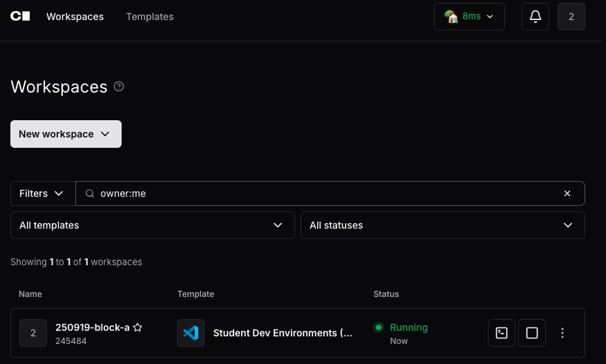
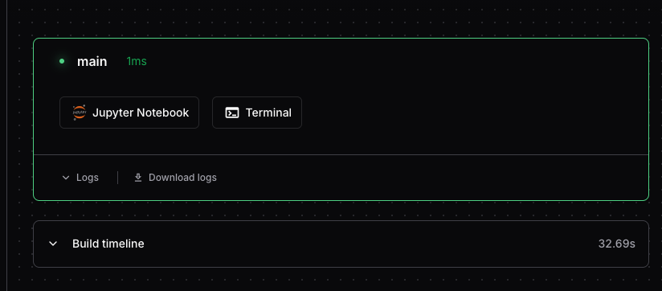
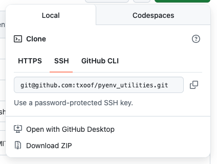

# Setup a BUas Coder.AI Environment

Setup a development environment with SSH access to GitHub and optional reverse tunneling for direct terminal access. This environment is suitable for training AI models and general development work.

## Requirements

- Working access to the [BUas Coder.ai environment](http://coder.ai.buas.nl)
  - Authenticate with your student GitHub account
  - Request a password from your instructor
- A working and active connection to the BUas VPN for off-campus access
- Setup scripts (download these to your local machine first):
  - [`setup.sh`](https://raw.githubusercontent.com/AaronCiuffo245484/coder_ai_setup/main/setup.sh): Initial environment configuration
  - [`startup.sh`](https://raw.githubusercontent.com/AaronCiuffo245484/coder_ai_setup/main/startup.sh): Post-restart restoration script
  - [`packages.txt`](https://raw.githubusercontent.com/AaronCiuffo245484/coder_ai_setup/main/packages.txt): System packages to install (optional - edit as needed)

## Initial Workspace Creation

**Note: You must have an active BUas VPN connection or be connected to the BUas network.**

From the Coder.ai landing page:



1. Click on "Workspaces"
2. Choose: New Workspace > Student Dev Environment
3. Enter a workspace name (e.g., "Block-2a-dev")
4. Leave other settings unchanged
5. Click "Create workspace"
6. Wait for the workspace to build

Once created, select the appropriate image for your project and ensure it shows "Running" status.

## Environment Setup

### Upload Setup Scripts



1. From the workspace page, click "Jupyter Notebook" to launch the file manager
2. Navigate to your home directory (typically `/home/<your year & block>/`)
3. Click "Upload" and select the downloaded scripts:
   - `setup.sh`
   - `startup.sh`
   - `packages.txt` (optional)
4. Close the file manager when complete

### Run Initial Setup

1. From the workspace page, click "Terminal" to launch a bash shell
2. Verify you're in your home directory:
   ```bash
   pwd
   # Should show something like /home/y2b/ or /home/y3a/
   cd /home/<your year & block>/
   ```
3. Make scripts executable:
   ```bash
   chmod +x setup.sh startup.sh
   ```
4. Run the setup script:
   ```bash
   ./setup.sh
   ```
5. When prompted, verify the directory path is correct and type `y` to continue
6. Follow the on-screen instructions carefully

### Understanding SSH Keys

The setup script will generate an SSH key pair and prompt you to add the public key to GitHub.

**SECURITY WARNING: NEVER add an SSH public key to your GitHub account unless you completely trust the source!**

Adding an SSH public key to your GitHub account grants complete access to your repositories to whoever holds the private key. In this case, YOU hold the private key at `/home/<your year & block>/ssh/id_ed25519`. 

**NEVER share this private key file with anyone. EVER.**

#### Adding Your SSH Key to GitHub

When prompted by the setup script:

1. Copy the public key displayed (the entire line starting with `ssh-ed25519`)
2. Visit https://github.com/settings/keys
3. Click "New SSH key"
4. Enter a title like "BUas Coder.ai Workspace"
5. Paste the key in the "Key" field
6. Click "Add SSH key"
7. Return to the terminal and press Enter to continue

#### Cloning Your Repository

After adding your SSH key, you'll be prompted to enter a repository URL. You can find this on your GitHub project page:



1. Go to your repository on GitHub
2. Click "Code" > "Local" > "SSH"
3. Copy the URL (format: `git@github.com:username/repo.git`)
4. Paste it when prompted by the setup script

The repository will be cloned to your home directory.

## Customizing Your Environment with packages.txt

The `packages.txt` file allows you to automatically install system packages every time your workspace starts. This is useful for installing tools and libraries that aren't included in the base image.

### Format

The file should contain one package name per line:

```
# This is a comment - lines starting with # are ignored
vim
htop
tmux
tree
```

### Common Packages

Here are some commonly useful packages:

**Text editors:**
- `vim` - Vi improved text editor
- `nano` - Simple text editor
- `emacs` - Extensible text editor

**System monitoring:**
- `htop` - Interactive process viewer
- `iotop` - I/O monitoring
- `ncdu` - Disk usage analyzer

**Development tools:**
- `tmux` - Terminal multiplexer
- `tree` - Directory structure viewer
- `jq` - JSON processor
- `curl` - Data transfer tool
- `wget` - File downloader

**Build tools:**
- `build-essential` - Compilation tools (gcc, make, etc.)
- `cmake` - Cross-platform build system
- `git-lfs` - Git Large File Storage

### How It Works

When you run `startup.sh` after a workspace restart:
1. The script checks if `packages.txt` exists in your home directory
2. If found, it reads the file (skipping comments and empty lines)
3. Checks if the apt package cache is older than 15 days
4. Updates the cache if needed
5. Installs all listed packages using `apt-get install`

### Adding Packages

You can edit `packages.txt` at any time:

**Via Jupyter file manager:**
1. Open Jupyter from the workspace page
2. Navigate to your home directory
3. Open `packages.txt` (or create it if it doesn't exist)
4. Add one package name per line
5. Save the file

**Via terminal:**
```bash
# Add a package to the file
echo "htop" >> /home/<your year & block>/packages.txt

# Edit the file directly
nano /home/<your year & block>/packages.txt
```

### Notes

- Package installation requires the apt cache to be updated, which can take time on first run
- Not all packages are available - if a package fails, check the name on https://packages.ubuntu.com
- Python packages should be installed via `pip`, not through `packages.txt`
- The workspace may already have many development tools pre-installed

## After Workspace Restarts

When your workspace restarts (due to inactivity or maintenance), you'll need to restore your SSH configuration:

1. Open a terminal from the workspace page
2. Navigate to your home directory:
   ```bash
   cd /home/<your year & block>/
   ```
3. Run the startup script:
   ```bash
   ./startup.sh
   ```
4. Verify the directory and type `y` to continue

The startup script will:
- Restore your SSH keys from persistent storage
- Install any packages listed in `packages.txt`
- Test your GitHub connection

You can then continue working with git as normal.

## VSCode Coder.ai Extension

You can connect to your coder.ai workspace directly from VSCode using the official Coder extension, enabling you to work with remote files, terminals, and most importantly, the remote Jupyter kernel for running notebooks.

### Installing the Coder Extension

1. Open VSCode on your local machine
2. Go to Extensions (Ctrl+Shift+X / Cmd+Shift+X)
3. Search for "Coder"
4. Install the official "Coder" extension by Coder
5. Restart VSCode if prompted

### Connecting to Your Workspace

1. Click the Coder icon in the VSCode sidebar (or use Command Palette: "Coder: Open")
2. Click "Add Workspace" or the "+" icon
3. Enter your coder.ai URL: `http://coder.ai.buas.nl`
4. Authenticate with your credentials
5. Select your workspace from the list
6. VSCode will connect and reload with a remote connection

You should now see your workspace files in the Explorer pane and can open terminals that run directly on your coder.ai instance.

### Using the Remote Jupyter Kernel

The coder.ai workspace provides a Jupyter server that you can connect to from VSCode for running notebooks.

#### Step 1: Install Jupyter Extension

Make sure you have the Jupyter extension installed on the remote:

1. With your VSCode connected to coder.ai, open Extensions (Ctrl+Shift+X / Cmd+Shift+X)
2. Search for "Jupyter"
3. Install the official "Jupyter" extension by Microsoft
4. If you see "Install in SSH: [hostname]", click it to install on the remote
5. Reload VSCode if prompted

#### Step 2: Get the Jupyter Server URL

Open a terminal in VSCode (it should be connected to your remote workspace) and run:

```bash
jupyter notebook list --json
```

You should see output like:
```json
{"base_url": "/@245484/Y2B-20251120-v0p4.main/apps/jupyter/", "hostname": "0.0.0.0", "notebook_dir": "/home/y2b", "password": false, "pid": 271, "port": 8888, "secure": false, "sock": "", "token": "", "url": "http://0.0.0.0:8888/@245484/Y2B-20251120-v0p4.main/apps/jupyter/"}
```

Note the `url` field - this is your Jupyter server URL. The server typically runs without a token (token is empty).

#### Step 3: Connect VSCode to the Jupyter Server

1. Open Command Palette (Ctrl+Shift+P / Cmd+Shift+P)
2. Type: `Jupyter: Specify Jupyter Server for Connections`
3. Select "Existing: Specify the URI of an existing server"
4. Enter the full URL from the previous step: `http://0.0.0.0:8888/@245484/Y2B-20251120-v0p4.main/apps/jupyter/`
   - Replace the path after `/8888/` with your actual base_url from the JSON output
   - No token is needed since the server runs without authentication

#### Step 4: Use the Jupyter Kernel

Now you can use Jupyter notebooks with the remote kernel:

1. Open or create a `.ipynb` file in your workspace
2. Click "Select Kernel" in the top right of the notebook
3. Choose "Existing Jupyter Server"
4. Select the server you just configured
5. Choose your desired Python environment (e.g., Python 3)
6. Run a test cell to verify the connection:
   ```python
   import sys
   print(f"Running on: {sys.version}")
   print(f"Python path: {sys.executable}")
   ```

You should see output confirming you're running on the remote coder.ai environment.

#### Step 5: Verify GPU Access (if applicable)

If your workspace has GPU access, test it with:

```python
import torch
print(f"CUDA available: {torch.cuda.is_available()}")
if torch.cuda.is_available():
    print(f"GPU: {torch.cuda.get_device_name(0)}")
```

### Troubleshooting VSCode Connection

#### Jupyter Server Connection Issues

If you can't connect to the Jupyter server:

1. Verify the server is running:
   ```bash
   jupyter notebook list
   ```
2. Check the exact URL format - it should include the full base_url path
3. Try reconnecting VSCode to the workspace (disconnect and reconnect from the Coder sidebar)

#### Kernel Won't Start

If the kernel connects but won't start:

1. Check for Python environment issues in the remote terminal:
   ```bash
   python --version
   which python
   ```
2. Try selecting a different kernel from the kernel picker
3. Restart the Jupyter server (requires stopping it from the coder.ai web interface and starting it again)

#### VSCode Can't Find Remote Files

If files don't appear after connecting:

1. Ensure you've selected the correct workspace in the Coder extension
2. Check you have proper file permissions in your workspace
3. Try reloading the VSCode window (Command Palette → "Developer: Reload Window")

### Benefits of Using VSCode with Coder.ai

- **Full IDE experience** with IntelliSense, debugging, and extensions
- **Native Jupyter notebook support** with better editing than the web interface
- **Integrated terminal** for running commands alongside your code
- **Git integration** works seamlessly with your configured SSH keys
- **Extension ecosystem** - install VSCode extensions that run on the remote
- **Local file editing** of remote files without manual uploading

## Troubleshooting

### Git Operations Fail or Timeout

If `git` operations take a long time and ultimately fail:

1. Run the startup script again to restore SSH configuration:
   ```bash
   cd /home/<your year & block>/
   ./startup.sh
   ```
2. Test GitHub connectivity:
   ```bash
   ssh -T git@github.com
   ```
   You should see: "Hi username! You've successfully authenticated..."

### SSH Key Not Working

If you can't authenticate with GitHub:

1. Verify your public key is added to GitHub at https://github.com/settings/keys
2. Check that your SSH keys exist in persistent storage:
   ```bash
   ls -la /home/<your year & block>/ssh/
   ```
3. Re-run startup.sh to restore keys to `~/.ssh/`

### Git Reports "Dubious Ownership" or Permission Errors

**Symptoms:** Git operations fail with errors about dubious ownership or SSH refuses to use your keys due to permission issues.

**Cause:** After a workspace restart, file ownership in your SSH directory may no longer match your current user, or permissions may have been reset.

**Solution:** 

The `startup.sh` script automatically fixes ownership and permissions, but if you encounter this error, you can manually fix it:

```bash
# Fix ownership (if running as root)
chown -R root:root /home/<your year & block>/ssh/

# Fix permissions
chmod 700 /home/<your year & block>/ssh/
chmod 600 /home/<your year & block>/ssh/id_ed25519
chmod 644 /home/<your year & block>/ssh/id_ed25519.pub
chmod 600 /home/<your year & block>/ssh/config

# Then re-run startup to copy with correct permissions
cd /home/<your year & block>/
./startup.sh
```

This resets ownership for your current user and ensures proper permissions on all SSH files.

*Thanks to Alex K for identifying this issue.*

### Packages Not Installing

If packages fail to install:

1. Check your `packages.txt` file for syntax errors (one package per line)
2. Verify you have sudo/root privileges
3. Manually update apt cache:
   ```bash
   sudo apt-get update
   ```

### Pip Commands Don't Work via SSH Tunnel

**Symptoms:** When connected via SSH tunnel, pip commands fail with "externally-managed-environment" error, but work fine in the coder.ai web terminal.

**Cause:** The coder.ai web terminal sets environment variables (like `PIP_BREAK_SYSTEM_PACKAGES=1`) that SSH sessions don't inherit by default.

**Solution:** 

The `ssh_setup.sh` script creates a `.coder_env` file that sets these variables. Make sure:

1. You've run `ssh_setup.sh` after the most recent restart
2. Your `~/.bashrc` sources the environment file:
   ```bash
   tail -5 ~/.bashrc
   # Should show: source /home/<your year & block>/.coder_env
   ```
3. You're using a login shell when connecting:
   ```bash
   # Use this connection method (note the 'bash -l'):
   ssh -t -p 443 USER@ssh.myhost.com 'ssh -t -p 10022 root@localhost "bash -l"'
   ```

If pip still doesn't work, manually source the environment:
```bash
source /home/<your year & block>/.coder_env
echo $PIP_BREAK_SYSTEM_PACKAGES  # Should show: 1
```

### SSH Connection Starts in /root Instead of Working Directory

**Symptoms:** When connecting via SSH tunnel, you start in `/root` instead of your project directory.

**Solution:** 

Include `cd /home/<your year & block>` in your connection command:

```bash
ssh -t -p 443 USER@ssh.myhost.com 'ssh -t -p 10022 root@localhost "bash -l -c \"cd /home/<your year & block> && tmux -CC new -A -s myshell\""'
```

The `cd` command must be inside the `bash -l -c` context so it happens before tmux starts.

---

## Optional: Direct SSH Access via Reverse Tunnel

For advanced users who prefer working in a local terminal instead of the web interface, you can set up a reverse SSH tunnel to connect directly from your laptop.

### Requirements

- A server with a public IP address that you control (e.g., `ssh.myhost.com`)
- SSH access to that server on port 443
- Your coder.ai workspace SSH public key added to your server's authorized_keys

### Additional Scripts

Download these additional scripts:

- [`ssh_setup.sh`](https://raw.githubusercontent.com/AaronCiuffo245484/coder_ai_setup/main/ssh_setup.sh): Configure SSH server on coder.ai
- [`tunnel.sh`](https://raw.githubusercontent.com/AaronCiuffo245484/coder_ai_setup/main/tunnel.sh): Start reverse tunnel
- [`tunnel_stop.sh`](https://raw.githubusercontent.com/AaronCiuffo245484/coder_ai_setup/main/tunnel_stop.sh): Stop reverse tunnel

### Setup Process

1. Upload the additional scripts to your home directory
2. Make them executable:
   ```bash
   cd /home/<your year & block>/
   chmod +x ssh_setup.sh tunnel.sh tunnel_stop.sh
   ```

3. **Configure SSH server** (run once per workspace instance):
   ```bash
   ./ssh_setup.sh
   ```
   This will:
   - Install OpenSSH server
   - Configure it for root login
   - Set up your authorized_keys for passwordless access (if available)
   - Prompt you to set a root password

4. **Add your laptop's public key** for passwordless access:
   
   On your laptop:
   ```bash
   cat ~/.ssh/id_ed25519.pub  # or id_rsa.pub
   ```
   
   Copy the output, then on coder.ai:
   ```bash
   echo "YOUR_PUBLIC_KEY" > /home/<your year & block>/ssh/authorized_keys
   ```
   
   Run `ssh_setup.sh` again to install the key.

5. **Start the reverse tunnel**:
   ```bash
   ./tunnel.sh
   ```
   
   When prompted:
   - Enter your server hostname (e.g., `ssh.myhost.com`)
   - Enter your username on that server
   - Verify the configuration
   
   The tunnel will start in the background and display connection instructions.

### Connecting from Your Laptop

Once the tunnel is running, you can connect from your laptop. The SSH connection uses different environment initialization than the coder.ai web terminal, so we need to use specific commands to match that environment.

**Basic two-hop connection:**
```bash
ssh USERNAME@ssh.myhost.com
ssh -p 10022 root@localhost
```

**Direct connection with full environment (recommended):**

To get the same environment as the coder.ai web terminal (including pip compatibility, CUDA variables, and correct working directory):

```bash
ssh -t -p 443 USERNAME@ssh.myhost.com 'ssh -t -p 10022 root@localhost "cd /home/<your year & block> && bash -l"'
```

The `-l` flag launches a login shell which sources all environment configurations, and `cd` ensures you start in your working directory instead of `/root`.

**With iTerm2 tmux integration (best experience):**

For the best experience with native iTerm2 tmux integration:

```bash
ssh -t -p 443 USERNAME@ssh.myhost.com 'ssh -t -p 10022 root@localhost "bash -l -c \"cd /home/<your year & block> && tmux -CC new -A -s myshell\""'
```

Replace `USERNAME` with your actual username, `443` with your server's SSH port if different, and `/home/<your year & block>` with your actual home directory.

This command:
- Uses login shell (`bash -l`) to load all environment variables
- Changes to your working directory before starting tmux
- Creates or attaches to a tmux session named "myshell"
- Uses iTerm2's native tmux integration mode (`-CC`)

**Understanding the Environment Difference:**

The coder.ai web terminal sets environment variables like `PIP_BREAK_SYSTEM_PACKAGES=1` that allow pip to work. SSH sessions don't automatically get these variables. The `ssh_setup.sh` script creates a `.coder_env` file that's sourced by `.bashrc` to provide these variables. Using `bash -l` ensures this file is sourced.

**Setting up an iTerm2 profile:**

For easy access, create an iTerm2 profile:
1. Open iTerm2 → Preferences → Profiles
2. Create a new profile (e.g., "Coder.ai")
3. In the "General" tab, set the command to the tmux command above (with your actual username and directory)
4. Save the profile

Now you can launch your coder.ai workspace with native tmux integration directly from iTerm2.

### Managing the Tunnel

**Check tunnel status:**
```bash
ps aux | grep ssh | grep 10022
tail -f /tmp/tunnel.log
```

**Stop the tunnel:**
```bash
./tunnel_stop.sh
```

**Restart after workspace restart:**

After each workspace restart, you'll need to:
1. Run `./ssh_setup.sh` to restore SSH server
2. Run `./tunnel.sh` to restart the reverse tunnel

### Security Considerations

- The reverse tunnel requires your server to have `GatewayPorts` configured appropriately
- Keep `GatewayPorts no` (default) for maximum security - this restricts tunnel access to localhost on your server
- Never share your private SSH keys
- Use strong passwords or key-based authentication only
- Consider setting up firewall rules on your server to restrict access

---

## Additional Resources

- [GitHub SSH Documentation](https://docs.github.com/en/authentication/connecting-to-github-with-ssh)
- [Git Basics Documentation](https://git-scm.com/book/en/v2/Getting-Started-Git-Basics)
- [iTerm2 tmux Integration](https://iterm2.com/documentation-tmux-integration.html)

## Support

For issues related to:
- Workspace access: Contact your instructor
- VPN connection: Contact BUas IT support
- Script errors: Check the troubleshooting section above